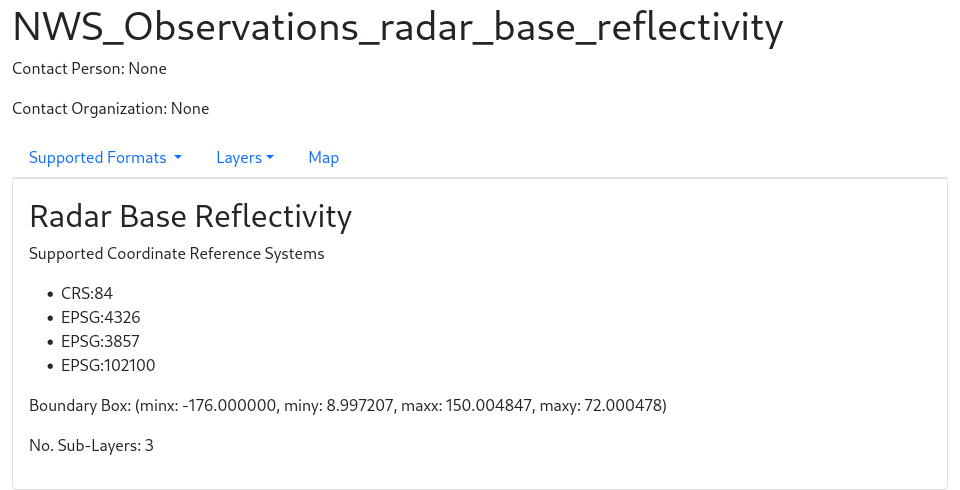
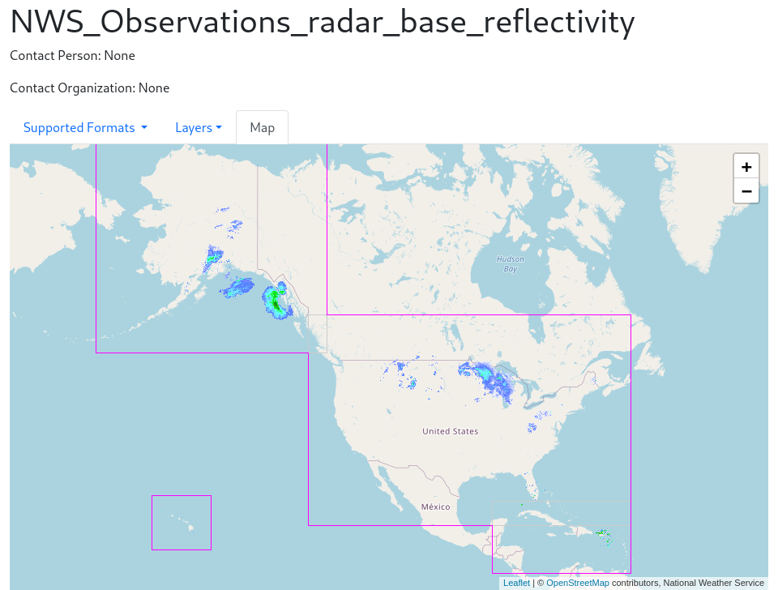

# XSLT Example

This is an example I used in class to show my fellow students how 
xsl can transform xml into other formats. 

The long and short of it is the `WMSServer.xml` is a copy of National Weather
Service (NWS) Base Reflectivity Radar Web Map Server (WMS) [GetCapabilities
response][1].

The `WMSServer.xsl` file transform the xml into html and javascript to show
services capabilites and produces a webmap with the Leaflet.js package. 


## Usage


```bash
$ git clone git@github.com:nasumilu/xslt_example.git
```
To avoid a Cross-Origin Request Block by the browser the `WMSServer.xml` 
*MUST* be read via an HTTP request. Unless you have a local nginx or apache 
running the easiest way to accomplish this is with php built-in server.

### Using php built-in web server
```bash
$ git clone git@github.com:nasumilu/xslt_example.git
$ cd xslt_example
$ php -S 127.0.0.1:8000
```

## Expected Webpage

With the local server running open a modern browser and point it to 
`http://localhost:8000/WMSServer.xml` and the xml document should 
be transformed to the following:




[1]:https://idpgis.ncep.noaa.gov/arcgis/services/NWS_Observations/radar_base_reflectivity/MapServer/WMSServer?request=GetCapabilities&service=WMS
 
